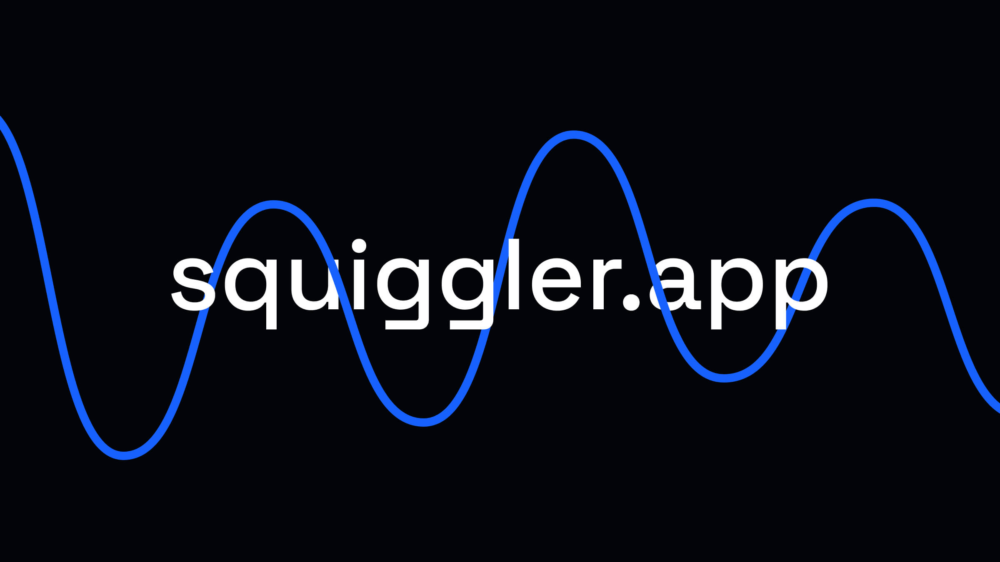

  

  <strong>Squiggler</strong> is a free generative design tool to help you quickly create random, unique SVG waves and squiggles. It is built with Svelte, Vite and Typescript. Check it out at <a href="https://www.squiggler.app/">squiggler.app</a>.

